# Parts needed
- Raspberry Pi 3b or heigher
- Minimum of 16GB micro SD card (minimum size can be 4Gb, 16 - 64Gb is recommended as you will later store print files on this card. Never cheap out on build parts, that includes quality SD card as well)
# Overview
Raspberry Pi Imager is the quick and easy way to install MainsailOS and other operating systems to a microSD card, ready to use with your Raspberry Pi. 
Download and install Raspberry Pi Imager to a computer with an SD card reader. 
Put the SD card you'll use with your Raspberry Pi into the reader and run Raspberry Pi Imager.

If you don't have "Raspberry Pi Imager" installed on your computer, then it's time to do it now!
You can download it here: <a href="https://www.raspberrypi.com/software/">Raspberry Pi Imager</a>

What is MainsailOS?
MainsailOS is a prebuilt image for several Single Board Computers (SBC) models. It contains some pre-configuration and software needed to run with  firmware and 
as your WebGUI to control your 3D printer.
MainsailOS images includes:

- Mainsail
- Klipper
- Moonraker
- Crowsnest as webcam daemon​
- Sonar as keep alive daemon
- Timelapse plugin for Moonraker
- Preinstalled software dependencies:
  - Measuring Resonances
  - Katapult (Former CanBoot)
  - KlipperScreen

​MainsailOS is not the "all in one" solution for any use case. It is just a simple and easy starting point to enjoy Mainsail and its features.

# Setup
1. Start "Raspberry Pi Imager" and press "CHOOSE OS"
   
   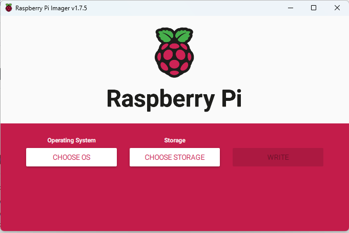
   
2. Scroll down and pick "Other Specific-Purpose OS"
   
   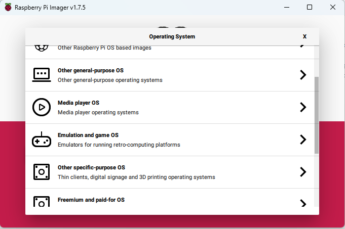
   
3. Here you choose option "3D Printing"
   
   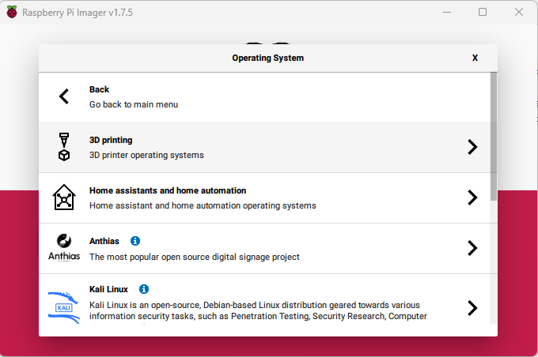
   
4. Now you have to decide operatingsystem and we pick "Mainsail OS"
   
   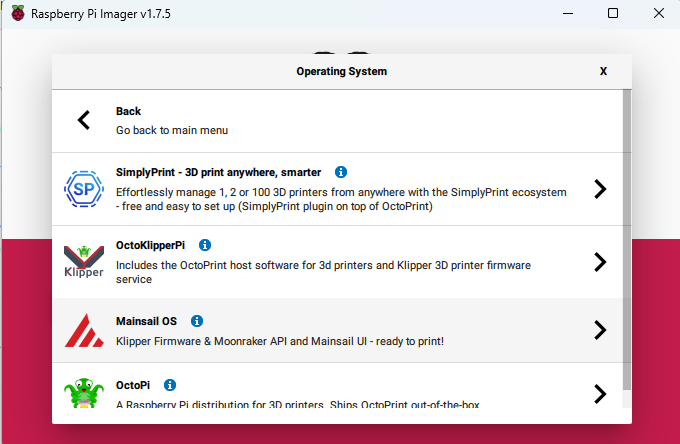
   
5. Recomended installation is "32-bit" so we pick that and move on
   
   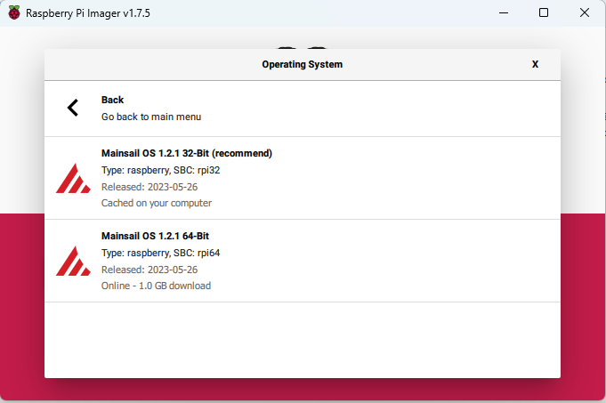
   
6. Next step is to choose storage
   
   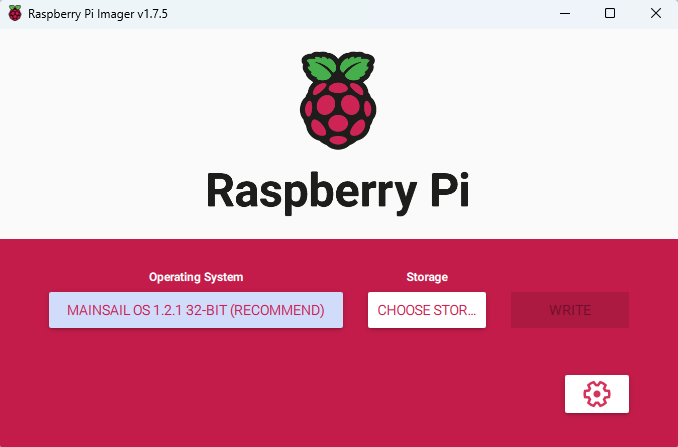

7. When you press "Choose Storage" yor promt to pick the SD card you have put into your reader. In this sample we pick "Generic Mass-Storage USB Device - 31.9 GB" and is mounted as E:\
   If you have more Cardreader conected to your computer be sure to pick correct SD card and move on!

   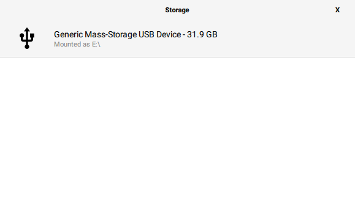

8. Before we we write image to the SD card we need to add hostname, Enable SSH, WIFI etc. so by pressing the wheel in the bottom right corner we marked with a green circle you enter advanced options for your MainsailOS installation.
   It's possible to skip this but if you are not an advanced user we recomend to follow this guide.

   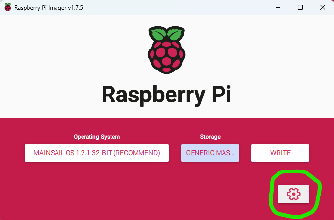

10. .........

   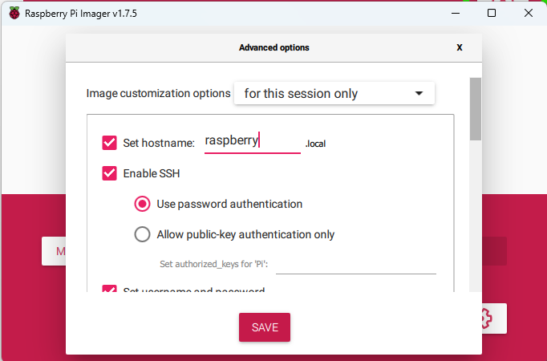

11. ........

    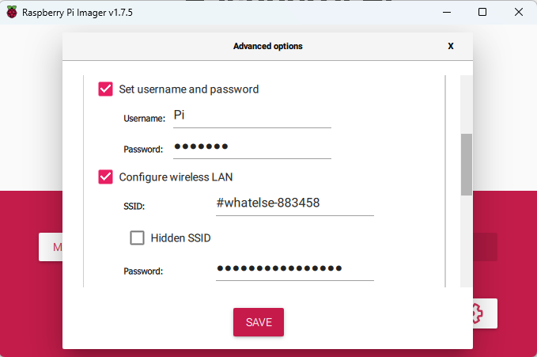

12. .........

     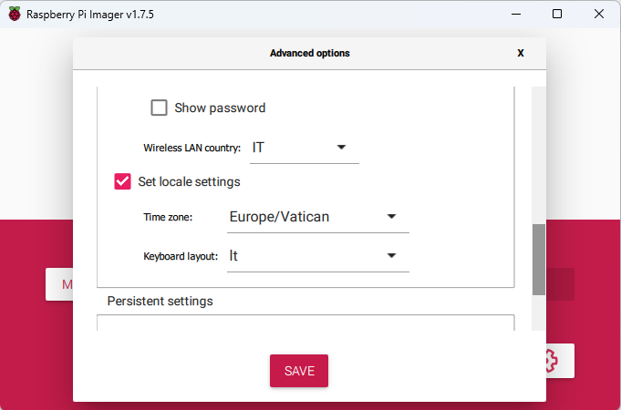

13. .........

    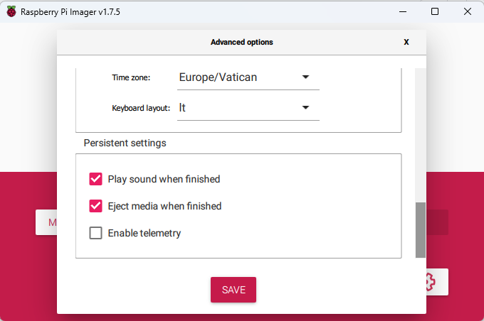

14. .........

    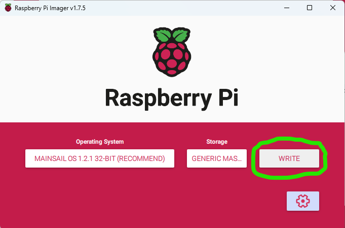

15. .........

    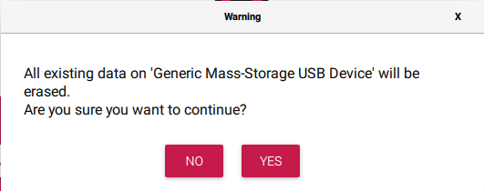

16. .........

    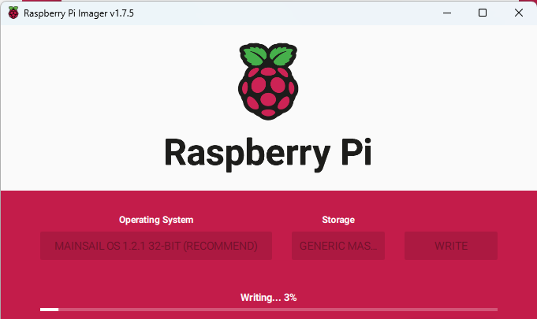

17. .........

    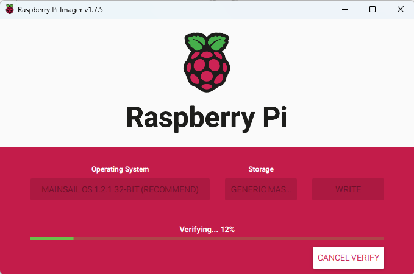

18. ..........

# Summary
